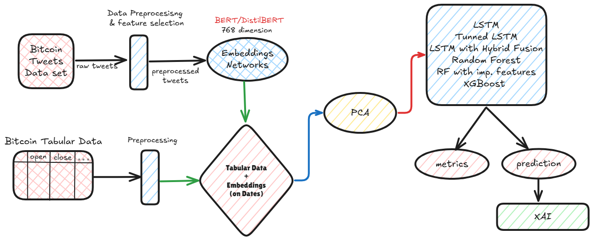
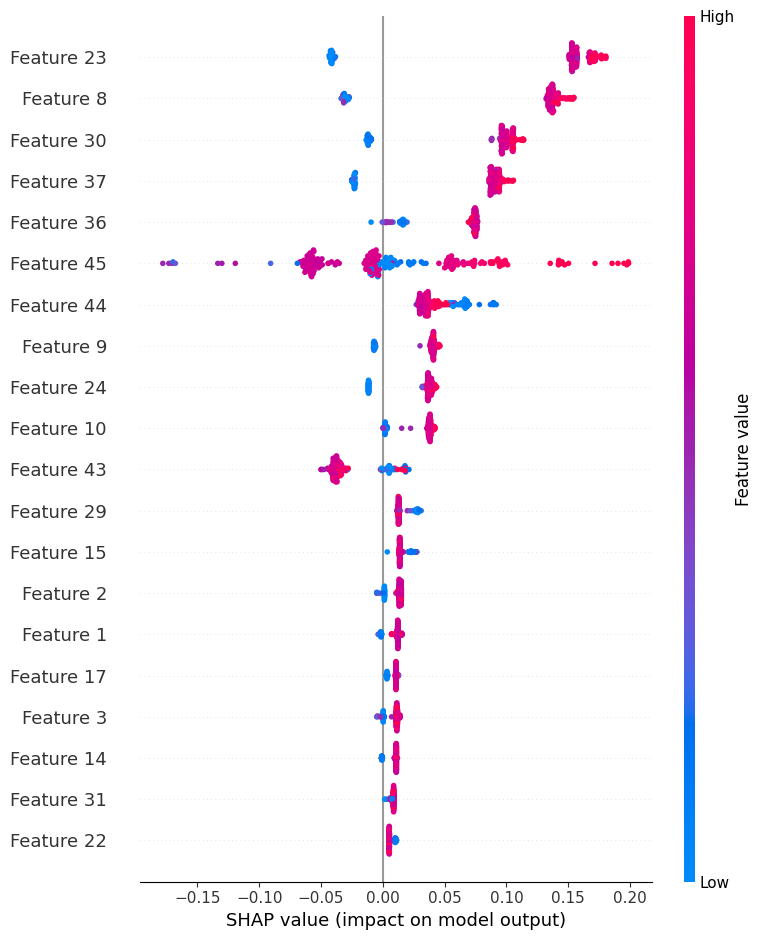
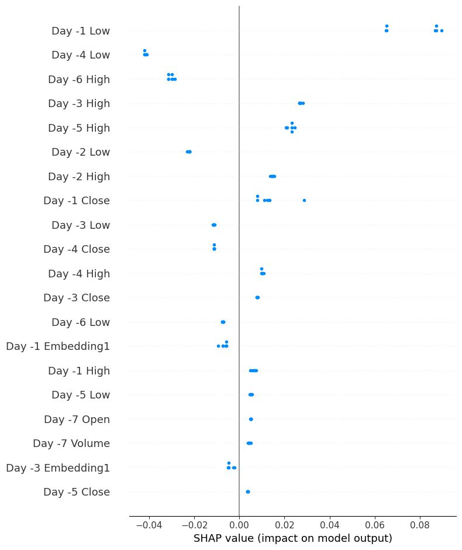

# CryptoSynth: A Multimodal Generative Framework for Bitcoin Price Forecasting

A comprehensive pipeline integrating sentiment analysis of social media data with Bitcoin price prediction using BERT, DistilBERT, LSTM, and XGBoost models.

## About

CryptoSynth explores a multimodal approach to forecast Bitcoin prices by leveraging:

- Sentiment analysis of approximately 150,000 Bitcoin-related tweets from the X platform.
- Transformer-based models (BERT and DistilBERT) for generating embeddings.
- Integration with historical Bitcoin prices and technical indicators.
- Advanced machine learning models including LSTM and XGBoost for prediction.
- Explainable AI (XAI) using SHAP for model interpretability.

The pipeline spans data collection, preprocessing, exploratory data analysis (EDA), sentiment classification, price prediction, and result visualization.

### Data Flow
- **Input**: Bitcoin Tweets Dataset and Tabular Data (open, close, etc.).
- **Data Preprocessing & Feature Selection**: Cleans and normalizes tweets, labels sentiments, and processes tabular data.
- **BERT/DistilBERT**: Generates embeddings from preprocessed tweets.
- **PCA**: Reduces dimensionality of combined embeddings and tabular data.
- **LSTM & Hybrid Fusion**: Applies LSTM with Random Forest and XGBoost for prediction.
- **Output**: Metrics and predictions.

## Key Features
- End-to-end sentiment analysis and price prediction.
- Integration of textual and numerical data for enhanced forecasting.
- Use of PCA for dimensionality reduction.
- Robust model evaluation with XGBoost as the best performer.
- XAI integration with SHAP for feature importance analysis.
- Comprehensive visualizations for insights.

## 🖼️ XGBoost Evaluation Metrics and XAI
### XGBoost Performance

### SHAP Value Impact

### SHAP Model Final Output

## 📊 Performance Metrics

### On BERT Embeddings
| Model                | MSE      | RMSE    | MAE    |
|----------------------|----------|---------|--------|
| Random Forest        | 0.0001837| 0.01355 | -      |
| Random Forest (Imp)  | 0.0001095| 0.01046 | -      |
| LSTM                 | 0.007127 | -       | 0.0664 |
| Tuned LSTM           | 0.00549  | -       | 0.0576 |
| LSTM (Hybrid Fusion) | 0.0049   | -       | 0.0512 |
| XGBoost              | 0.004678 | -       | -      |

### On DistilBERT Embeddings
| Model                | MSE      | RMSE    | MAE    |
|----------------------|----------|---------|--------|
| Random Forest        | 0.0002086| 0.01444 | -      |
| Random Forest (Imp)  | 0.0001095| 0.0146  | -      |
| LSTM                 | 0.01304  | -       | 0.0937 |
| Tuned LSTM           | 0.00364  | -       | 0.0443 |
| LSTM (Hybrid Fusion) | 0.0053   | -       | 0.0531 |
| XGBoost              | 0.0047   | -       | -      |

## Setup & Usage
### Requirements
Install necessary dependencies manually:
- `torch`, `transformers`, `numpy`, `pandas`, `sklearn`
- `matplotlib`, `tqdm`, `xgboost`, `shap`

### Documentation
Refer to the following:
- [CryptoSynth_report.pdf](documentation/CryptoSynth_report.pdf): Project background, methodology, and results.

## Contributions
We welcome feedback and contributions! Feel free to fork, star 🌟, and share.

## License
Licensed under the MIT License.
